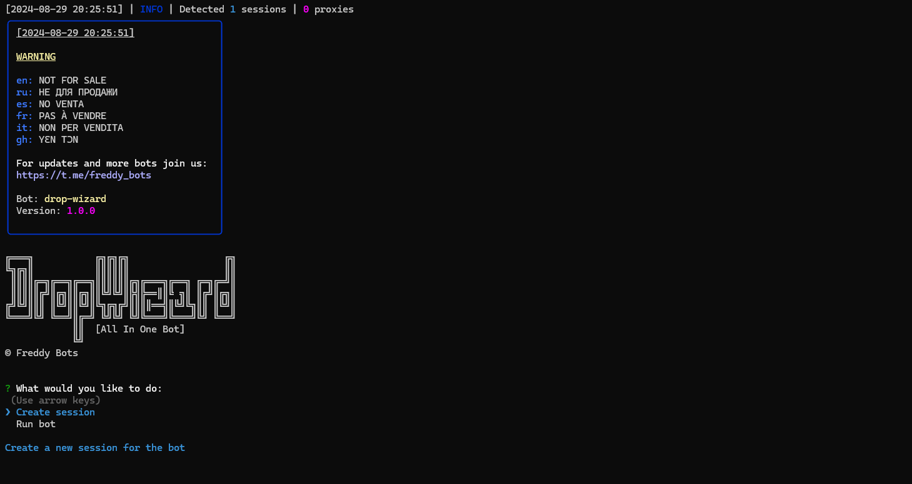

> [](https://t.me/roddyfred)



# Use Node.Js 18 or greater

## Functionality

| Available               | Status |
| ----------------------- | :----: |
| Blum                    |   ✅   |
| Rocky Rabbit            |   ✅   |
| ToMarket                |   ✅   |
| Dotcoin                 |   ⏳   |
| Character X             |   ⏳   |
| BunnyApp                |   ⏳   |
| Stay tune, more to come |   👻   |

### [How to get and add query id](https://github.com/Freddywhest/DropWizard/blob/main/AddQueryId.md)

## [Settings](https://github.com/FreddyWhest/DropWizard/blob/main/.env-general-example)

| Settings                     | Description                                                                  |
| ---------------------------- | ---------------------------------------------------------------------------- |
| **API_ID / API_HASH**        | Platform data from which to launch a Telegram session (stock - Android)      |
| **BLUM**                     | Whether to start `Blum` when the bot start (True / False)                    |
| **TOMARKET**                 | Whether to start `ToMarket` when the bot start (True / False)                |
| **ROCKYRABBIT**              | Whether to start `Rocky Rabbit` when the bot start (True / False)            |
| **USE_QUERY_ID_BLUM**        | Whether to use query ids instead of sessions `(BLUM)` (True / False)         |
| **USE_QUERY_ID_TOMARKET**    | Whether to use query ids instead of sessions `(TOMARKET)` (True / False)     |
| **USE_QUERY_ID_ROCKYRABBIT** | Whether to use query ids instead of sessions `(ROCKY RABBIT)` (True / False) |
| **USE_PROXY_FROM_FILE**      | Whether to use proxy from the `bot/config/proxies.js` file (True / False)    |

## Config Files

| File                   | Description                                                                                                                |
| ---------------------- | -------------------------------------------------------------------------------------------------------------------------- |
| **`.env-general`**     | Config file for `DropWizard`. [How to configure DropWizard](#settings)                                                     |
| **`.env-blum`**        | Config file for `Blum`. [How to configure Blum](https://github.com/Freddywhest/BlumBot/blob/main/README.md)                |
| **`.env-rockyrabbit`** | Config file for `Rocky Rabbit`. [How to configure Blum](https://github.com/Freddywhest/RockyRabbitBot/blob/main/README.md) |
| **`.env-tomarket`**    | Config file for `ToMarket`. [How to configure Blum](https://github.com/Freddywhest/ToMarketBot/blob/main/README.md)        |

## Installation

You can download [**Repository**](https://github.com/FreddyWhest/DropWizard) by cloning it to your system and installing the necessary dependencies:

```shell
~ >>> git clone https://github.com/FreddyWhest/DropWizard.git
~ >>> cd DropWizard

#Linux and MocOS
~/DropWizard >>> chmod +x check_node.sh
~/DropWizard >>> ./check_node.sh

OR

~/DropWizard >>> npm install
~/DropWizard >>> cp .env-general-example .env-general
~/DropWizard >>> cp .env-blum-example .env-blum
~/DropWizard >>> cp .env-tomarket-example .env-tomarket
~/DropWizard >>> cp .env-rockyrabbit-example .env-rockyrabbit
~/DropWizard >>> nano .env-general # Here you must specify your API_ID and API_HASH , the rest is taken by default
~/DropWizard >>> node index.js

#Windows
1. Double click on INSTALL.bat in DropWizard directory to install the dependencies
2. Double click on START.bat in DropWizard directory to start the bot

OR

~/DropWizard >>> npm install
~/DropWizard >>> cp .env-general-example .env-general
~/DropWizard >>> cp .env-blum-example .env-blum
~/DropWizard >>> cp .env-tomarket-example .env-tomarket
~/DropWizard >>> cp .env-rockyrabbit-example .env-rockyrabbit
~/DropWizard >>> # Edit .env-general and set your API_ID and API_HASH
~/DropWizard >>> node index.js
```

Also for quick launch you can use arguments, for example:

```shell
~/DropWizard >>> node index.js --action=1

OR

~/DropWizard >>> node index.js --action=2

#1 - Create session
#2 - Run clicker
```
